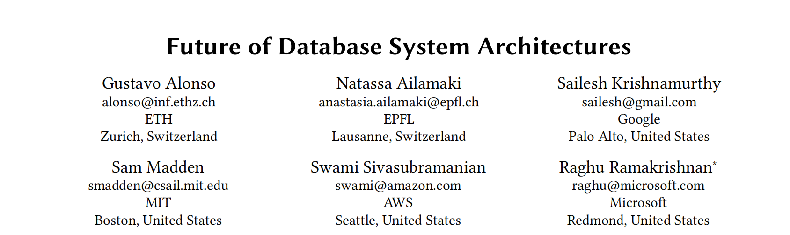

本文是对SIGMOD2023短文[Future of Database System Architectures](https://dl.acm.org/doi/abs/10.1145/3555041.3589360)的翻译。

# 未来数据库架构
## 摘要

在过去的二十年中，我们经历了多个领域的重大技术变革，其中最为显著的是云计算的兴起，云计算改变了数据库软件的架构基础。同时，我们也正见证几个新趋势，这些趋势同样在塑造数据管理的未来。

随着摩尔定律的终结，我们现在看到很多对硬件数据库加速器的探索（并且有许多初创公司获得了重大投资），这些加速器探索包括FPGA、GPU等技术。云计算的规模经济使得许多原本通过软件完成的工作可以转移到硬件上，并且这一趋势将继续并加强。

现代数据资产跨越了位于本地、边缘以及一个或多个公共云上的数据，这些数据有多种来源，如多个关系数据库、文件和存储系统以及NoSQL系统，这些系统包括操作型和分析型。这种现象被称为数据扩散`data sprawl`。

我们还看到许多新型数据工作负载的出现。例如，丰富的数据管道。最后，机器学习在数据库软件生命周期的每一个方面都正在迅速增加其角色。

这次SIGMOD小组讨论会将讨论上述变化和趋势对数据库硬件和软件架构的影响。这些变化将如何影响数据库系统设计，未来的数据库系统将呈现何种面貌？最难的研究挑战在哪里？从过去的经验

## 1. Introduction
在过去的二十年中，我们经历了多个领域的重大技术变革，其中最为显著的是云计算的兴起，这改变了数据库软件的架构基础:

- 存储和计算分离，帮助硬件和软件的分离
- 弹性资源分配
- 内存层次结构中的延迟增加
- SaaS的出现
- 大规模并行和分布式数据服务的出现
- 机器学习在管理云服务中的增加使用

随着摩尔定律的终结，我们现在看到很多对硬件数据库加速器的探索（并且有许多初创公司获得了重大投资），这些加速器探索包括FPGA、GPU等技术。云计算的规模经济使得许多原本通过软件完成的工作可以转移到硬件上，这一趋势将继续并加强。例如，网络功能虚拟化或云中急需的昂贵操作（如数据压缩和加密）正在转移到专用加速器上，并远离作为瓶颈的CPU。一旦加速器就位，它们就提供了许多进一步专门化的机会：智能网卡、智能存储、近数据处理、针对ML特定数据类型的定制算术/逻辑单元等。

这些案例中有趣的地方在于，使用加速器并不一定会更高效，但是加速器以某种方式扩展了计算节点的能力，从而释放出CPU，让CPU更多地用于用户工作负载。从数据库的角度看，我们不仅关注数据库引擎如何使用加速器让其核心功能变得更高效，而且更重要的是，引擎可以利用这些加速器提供哪些额外和新的功能。

从研究的角度来看，一个有趣的新领域正在涌现：数据处理以及特别是数据库如何影响和利用新兴的硬件趋势？硬件的演变和云的主导地位创造了一个独特的环境，推动计算朝着全新的方向发展。关于数据管理的大部分已有假设不再适用，许多已知的优化和设计在现代系统中已经是不相关甚至是有害的。

近年来，另一个数据趋势得到了加速：现代数据资产分布在位于本地、边缘以及一个或多个公共云上的数据中，涵盖了多种来源，如多个关系数据库、文件和存储系统，这些系统包括操作型分析的NoSQL系统。这种现象被称为数据扩散`data sprawl`。希望确保数据适当使用（包括访问控制、遵守公司政策，例如关于保留的政策，以及遵守如欧盟通用数据保护条例（GDPR）等外部法规）的数据管理员，必须对其数据进行清点，识别哪些数据是敏感的，并在整个广泛的数据资产中适当地管理这些敏感数据。

如今，数据治理完全是孤立的；每个数据子系统都有其自己的（且各不相同的）治理功能。对敏感数据的政策是通过使用针对每个数据源特定的自定义语言，逐个迭代所有数据源来逐件应用的。这使得数据治理变得繁琐、容易出错（因为必须手动在不同子系统中执行给定政策，很容易产生不一致），并且成本高昂。新兴的标准和系统，如开放政策代理（OPA）及其政策语言REGO，旨在解决这些挑战。

鉴于数据扩散`data sprawl`的现状，数据治理的未来形态将是什么样的，数据库架构又必须如何演变以支持这一需求？我们也看到许多新型数据工作负载的出现。例如，数据管道是一种日益常见的工作负载，如Apache Airflow等框架的增长和该领域的公司所证明的。设计高效的数据管道是否会变得越来越重要，或者云中心分析的出现会导致常见的管道模式（数据汇聚到湖或仓库）被商品化的简化？还有哪些工作负载可能会重新定义我们对数据管理的思考方式？

最后，机器学习在数据库软件生命周期的每一个方面都越来越重要，值得通过机器学习如何帮助解决我们强调的各种问题的视角来审视这些问题。特别是，像ChatGPT这样的基础模型的迅速出现，这些模型训练于非常大的语料库，可能会对未来每个与数据库交互的人的方式产生变革性影响；未来每个人都可能拥有一个基于FM的“助手”来帮助完成他们的任务。但这项技术将对数据库架构有何影响，对我们构建和运营数据服务的方式又会有何影响？

本次小组讨论将讨论上述变化和趋势。这些变化将如何影响数据库系统设计，近期数据库系统将呈现何种面貌？最困难的研究挑战在哪里？过去的经验教训将如何指导我们应对这些颠覆？未来的数据库系统架构是否会包容并意识到其资源，无论是存储、网络还是计算硬件？我们是否会看到朝向专业化的趋势（没有通用计算机，但为云部署量身定制的架构）？欢迎来听小组讨论并询问任何你关心的问题！
