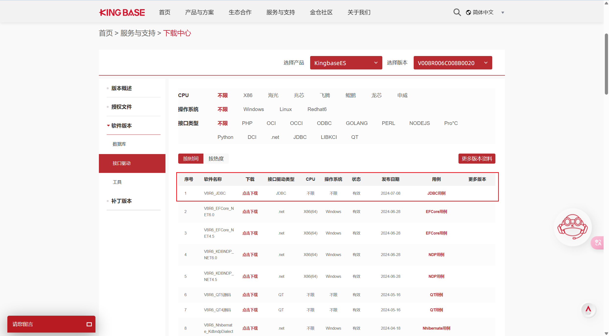
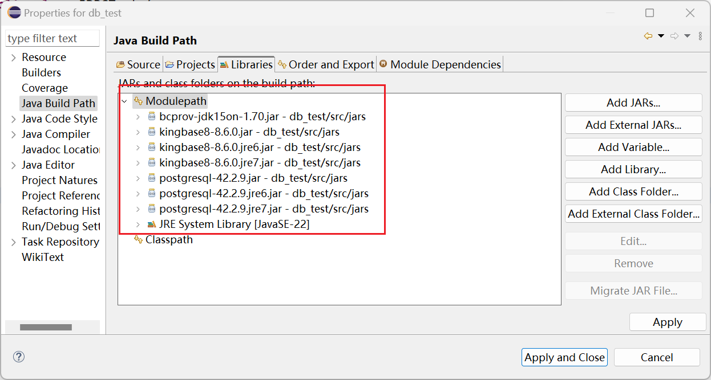
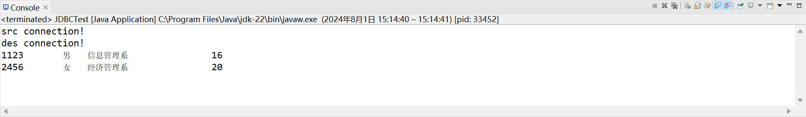

## Kingbase 介绍

前段时间因为一些原因需要安装[kingbase](https://www.kingbase.com.cn/)做JDBC的相关实验。网络上关于`kingbase`(也就是人大金仓)的资料确实很少。这里写一个教程从安装kingbase到运行一个简单的JDBC程序。

## Kingbase 安装

关于`kingbase`的安装包可以在官网的[下载中心](https://www.kingbase.com.cn/xzzx/index.htm)找到。
安装过程就不赘述了，除了管理员密码以外，其余都可以无脑用默认的设置。

连接`kingbase`需要用到它给的工具，名字是`KStudio`数据库开发管理工具。填上管理员密码就可以连接到`kingbase`了


其余的操作和使用其他数据库没有什么不同，包括创建数据库，创建模式，创建表等等。

## JDBC 编程

那么如何使用JDBC连接`kingbase`呢？

首先，我们需要安装`java`的环境（网络上关于如何安装`java`的教程很多，这里我们就不赘述了），以及一个IDE，这里我用的是`eclipse`。

然后这里我给出一段示例的`java`程序，这段程序的功能是将`kingbase`的`samples`数据库的`student`表的内容拷贝到`SamplesBackup`数据库中。

```java
package db_test;

import java.sql.Connection;
import java.sql.DriverManager;
import java.sql.Statement;
import java.sql.PreparedStatement;
import java.sql.ResultSet;
import java.util.Properties;


public class JDBCTest {
	public static void main(String[] args) {
		/* Step 1 定义句柄和变量 */
		String sSno, sName, sSex, sDepart;
		Integer sAge; 
		/* Step 2 初始化环境 */
		/* Step 3 :建立连接 */
		String driverName = "com.kingbase8.Driver"; //连接源数据库
		String src_url = "jdbc:kingbase8://127.0.0.1:54321/samples";
		Properties src_info = new Properties();
		src_info.put ("user", "SYSTEM");
		src_info.put ("password", "**********");
		src_info.put ("EscapeProcessing", "false");
		String dst_url = "jdbc:kingbase8://localhost:54321/SameplesBackup"; //连接目标数据库
		Properties dst_info = new Properties();
		dst_info.put ("user", "SYSTEM");
		dst_info.put ("password", "**********");
		dst_info.put ("EscapeProcessing", "false");
		try{
			Class.forName(driverName);
			Connection src_conn = DriverManager.getConnection(src_url,src_info);
			System.out.println("src connection!");
			Connection dst_conn = DriverManager.getConnection(dst_url, dst_info);
			System.out.println("des connection!");
 
			/* Step 4 :初始化语句句柄 */
			Statement src_stmt = src_conn.createStatement();
			PreparedStatement dst_prestmt = dst_conn.prepareStatement("INSERT INTO \"S-C\".STUDENT(SNO,SNAME,SSEX,SAGE,SDEPT) VALUES (?, ?, ?, ?, ?)");
			/* Step 5 :两种方式执行语句 */
			/*预编译带有参数的语句*/
			/*直接执行 SQL 语句*/

			ResultSet rs = src_stmt.executeQuery("SELECT * FROM \"S-C\".Student");
			/* Step 6 ：处理结果集并执行预编译后的语句*/
			while (rs.next())
			{
				sSno = rs.getString("SNO");
				sName = rs.getString("SNAME");
				sSex = rs.getString("SSEX");
				sAge = rs.getInt("SAGE");
				sDepart = rs.getString("SDEPT");
				
				dst_prestmt.setString(1, sSno);
				dst_prestmt.setString(2, sName);
				dst_prestmt.setString(3, sSex);
				dst_prestmt.setInt(4, sAge);
				dst_prestmt.setString(5, sName);
			 
				dst_prestmt.executeUpdate();
 
				System.out.println(sSno + sName + sSex + sDepart + sAge);
			}
			
			/* Step 7 中止处理*/
			rs.close();
			src_stmt.close();
			dst_prestmt.close();
			src_conn.close();
			dst_conn.close();
		}
		catch (Exception e)
		{
			System.out.println(e.getMessage());
		}
	}
}
```

用户密码需要自己手动补全。

那么我们如何运行这段程序呢？
这里我们需要从`kingbase`官网的[下载中心](https://www.kingbase.com.cn/xzzx/index.htm)里中找到JDBC的驱动


然后在项目中加载这些驱动即可。在`eclipse`中，我们可以点击`File->Properties->Libraries-Add JARs`，选择我们下载的`jar`包，然后点击`Apply`加载`JDBC`驱动。

这里我已经加载好了


现在我们就可以运行这一段程序了


