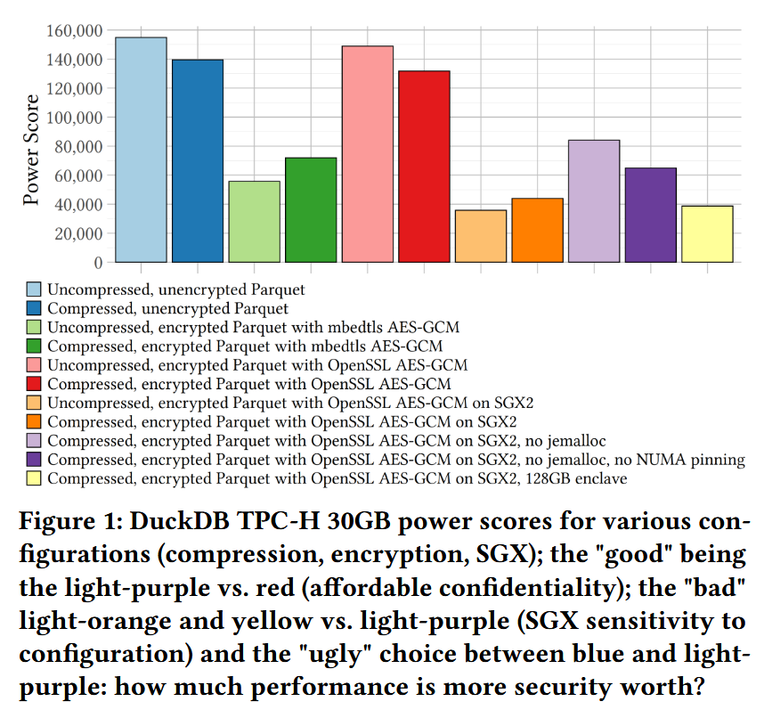
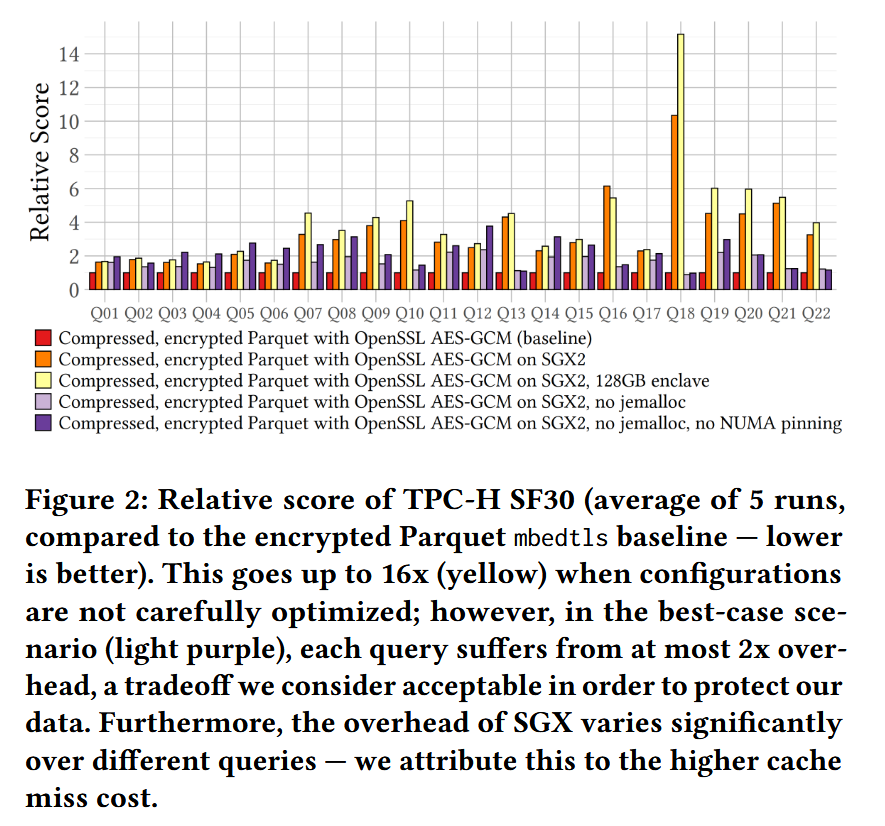

# Introduction

可信计算（Confidential Computing）期望将计算操作放入可信执行硬件（TEE）执行从而保护数据的安全。
第一个主流的可信执行硬件是Intel SGX，SGX的工作原理是在内存中创建一个专用的可信区域，又称enclave。enclave中所有的代码和数据都会被加密，而且之后被送到CPU（CPU的寄存器或者缓存）时才会被解密，从而保护了enclave中的代码和数据不会被其他恶意用户攻击。

SGX通过ecall(enclave call)和ocall(out call)实现在enclave内部和enclave外部之间的互相调用。enclave外部可以使用ecall调用enclave内部的代码，并将控制流转移到enclave内部，类似地，enclave内部也可以通过ocall调用enclave外部地代码，从而将控制流转移到enclave外部。这些调用因为涉及到CPU上下文等切换以及TLB刷新等操作，因此交换的代价很高。
SGX在内存中会创建一块专用的处理器保留内存(PRM)用于隔离来自enclave外部的访问。PRM里面包含了Enclave Page Cache（EPC），EPC是专门用来存放加密代码和数据的地方。初代SGX的EPC最大只能有256MB，对于开发可信数据库来说限制太大了。大多数基于SGX1的可信数据库，例如StealthDB, EncDBDB, CryptSQLite, EnclaveDB等，都会受到严重的性能下降或者只提供较弱的安全性。

而最新一代SGX2的EPC已经扩展到了512GB，这对于开发可信数据库来说带来了许多新的可能性。不过目前基于SGX2的研究还相对较少，[14]描述了在可信执行环境（TEE）中执行连接操作时遇到的瓶颈和挑战。[7]对SGX2进行了基准测试，显示与内存中的B-Tree相比存在约25%的性能开销。近期研究[13]对SGX2上的分析型工作负载进行了评估，发现性能开销主要存在于哈希连接和基数连接中，并深入探究了其成因。研究指出SGX2的大部分开销可归因于昂贵的随机内存访问，以及CPU在飞地（enclave）内执行代码方式的差异。此外，研究还警示在飞地内部使用内置库可能导致性能下降。

SGX Enclave仅能在数据处理过程中保障数据安全。然而，当数据离开飞地时，其安全性会再次暴露在攻击风险中，因此仍需额外保护。本文旨在通过提出一个**完全安全的系统**来延伸先前研究，不仅有效保障**使用中的数据（data in use）**，还能高效保护**静态数据（data at rest）**。

# DUCKDB-SGX2
**目标：保护使用中的数据（data in use），同时保护静态的数据（data at rest）**

**方法：**
- 使用中的数据采用SGX保护，使用Gramine将整个DuckDB放到SGX2里运行，使用中的数据就不会被纂改了。
- 静态数据采用加密保护：即使用加密技术将Parquet（一种存储格式）文件加密保护，读入Enclave之后再解密

**其中可能会影响性能的几个因素：**
1. **加密：**DuckDB本身支持对Parquet文件的加密，不过DuckDB出于兼容性的考虑，不会采用汇编语言或平台相关的内部函数（intrinsics），而是通过内联纯C++实现的mbedtls库处理加密数据。然而，ARM和X86架构均支持AES专用CPU指令（编译器无法自动生成），但DuckDB的Parquet加/解密功能并未利用这些硬件加速能力。
2. **内部库：**当运行多个需要构建大型哈希表的查询（例如Q18）时，性能会出现显著下降且难以解释。经过深入排查，最终通过禁用DuckDB在Linux系统下默认使用的jemalloc内存分配器（遵循DaMoN [6]的建议）解决了问题。我们认为glibc的malloc实现之所以性能更优，是因为其具备将未使用内存高效归还操作系统的能力，且无需触发EPC分页（即通过避免对已释放内存页进行加密）。
3. **压缩：**压缩可以减少Parquet的大小，从而减少加密的开销，以及ECALL和OCALL的开销。但是压缩本身需要一定的代价，因此并不一定会带来性能的提升。
4. **NUMA架构：**非统一内存架构。随着多核处理器的发展，特别是多路服务器（多个CPU插槽）的普及，所有CPU通过同一总线访问内存会导致瓶颈。这时候，NUMA通过将内存划分为多个节点，每个节点关联到特定的CPU，从而减少总线争用，提高性能。在NUMA架构中，每个CPU节点有自己的本地内存，访问本地内存较快，而访问其他节点的内存（远程内存）较慢。这种架构下，操作系统和应用程序需要考虑数据局部性，尽量让进程访问本地内存，以减少延迟。

# Evaluation
## 实验一

**注意：**
1. 最左侧（浅蓝色）是既不压缩，也不加密Parquet，并且执行过程也不放在SGX中
2. 蓝色是对Parquet进行压缩之后的性能，对比baseline下降了一点，这是因为压缩会带来一定的开销
3. 浅绿色是对Parquet使用自带的库加密之后的性能，可以发现下降了非常多，这是因为自带的加密库性能很差
4. 绿色是对Parquet既加密又压缩，这里性能比单纯加密还高一些，因为压缩之后减少了数据大小，加密的数据量减少很多，大大减少了加密的开销。
5. 淡红色是采用OpenSSL硬件加密的，可以发现相比于不加密几乎没有下降，硬件加密的速度太快了
6. 红色是采用OpenSSL硬件加密和压缩的，性能比单纯加密又下降了。这里很好理解，因为加密的速度太快了，压缩的数据量没有带来多少收益，所以比单纯加密性能会下降一点
7. 淡黄色是非压缩情况下，硬件加密情况下，在SGX2上的性能结果，可以发现对比红色下降还是蛮多的，这主要是因为jemalloc库的实现方式导致了大量的EPC Paging
8. 淡紫色是禁用掉jemalloc的性能，可以发现性能几乎提高了两倍
9. 紫色是不限制NUMA，性能会下降一点，这是因为多了跨内存访问，导致的性能下降，这主要和NUMA的架构有关。NUMA的架构中，每个CPU都自己的一块本地内存，访问本地内存的速度会很快，但是访问其他CPU的内存相应的就会变慢，因此如果把EPC都限制在一块，那么几乎不存在跨内存的访问就会快一些。
10. 最后的黄色是将EPC从64GB提升到128GB，性能相对于淡黄色提升很有限
## 实验二

然后作者分别在16个查询上跑了更仔细地版本。这里的纵坐标是相对值baseline的比值，纵坐标越小表示性能越好。通过图2可观察到部分查询的性能开销尤为显著：相对性能评分最差的查询（Q05、Q08、Q11、Q12、Q19）均涉及大规模聚合（large aggregations）或大表连接（large joins）。这些操作作为OLAP工作负载的典型代表，其性能瓶颈往往围绕哈希运算展开——在缓存未命中（cache misses）方面，哈希是最昂贵的操作之一。我们在实验环境中执行TPC-H查询时，所有缓存访问中最高出现了70%的未命中率。此问题已在此前研究中被指出[14][13]，其将SGX上连接操作的性能瓶颈归因于哈希机制。此外，针对包含大量唯一分组（unique groups）的聚合工作负载，SGX环境下的哈希聚合效率同样欠佳。

**SGX特有的性能劣化因素：**
- 缓存未命中与随机访问的放大效应：
SGX的飞地执行模式会加剧缓存未命中与随机内存访问的开销（如飞地内外上下文切换导致的缓存污染），需进一步研究其内在机理。
- ECALL/OCALL调用开销：
单次查询涉及的ECALL（飞地入口调用）与OCALL（飞地出口调用）次数高达数十万量级。由于数据库系统重度依赖I/O与内存拷贝，未来工作需探索定制化系统调用（custom syscalls）等机制，以降低此类开销、减少磁盘与内存间非必要的数据迁移及加解密操作。
- 加密内存的数据传输瓶颈：
加密页面的写放大（write amplification）及其元数据更新，导致CPU与加密内存间的数据传输成为另一性能瓶颈。
针对Parquet格式的优化启示：DuckDB的缓冲区管理器（buffer manager）可缓存其内部表格式的数据块，但未对Parquet（外部格式）实现此优化。若静态数据已预先加密，可探索在飞地外（non-enclave memory）进行数据缓存[2]，规避飞地内部机制引入的性能损耗。

# Secure Analysis
**Data at rest:** 通过加密保护，不过本文没有详细讨论加密的密钥管理。不过加密带来的一个问题是每次对数据的一些小修改就会导致整个文件的重新解密再加密，这会带来巨大的开销。虽然在OLAP的场景下，数据修改比较少，这个问题并不严重，但有效处理更新仍然是一个开放的研究领域。因此，敏感信息在磁盘上的静止和内存中都被加密，解密仅在CPU缓存中发生，并发出解密（汇总）结果。我们在负责任的分散数据体系结构（RDDA）[3]上的相关工作详细介绍了我们如何设计系统以在数据定义和操纵级别上保证用户隐私，从而利用SGX作为安全的计算技术来发出匿名查询结果。

**Data in use:** 处理上述措施之外，为了实现一个完全安全的系统，还需要在Enclave内部采取更多的措施维护使用中的数据的安全，例如：
- 隐藏访问模式
- 加密缓冲区
- 防止恶意信号注入
- 实施安全的核心外执行。

# 结论和未来工作
本文使用SGX2和Modular Parquet Encryption评估了DuckDB上分析查询的机密执行。我们的结果表明，配置良好的系统仅造成1.5倍的开销，这主要是由于飞地中CPU高速缓存的未命中的开销较高。但是，存在也存在其他性能危害，例如EPC分页，缺乏NUMA局部性等。我们对DuckDB进行了调整以使用AES CPU说明，从而大大加快了解密。另外，我们禁用Jemalloc，该Jemalloc是SGX-Unaware，并在内存片段后引起EPC分页。

此外，我们的原型没有解决一些必要的安全测量，例如第3节中所述的安全性测量，并且其性能未针对数据传输进行优化：当移动在飞地内部时，数据将两次加密，这会产生大量的开销。

未来的工作还包括实现新的系统调用，以使数据的解密仅在必要时发生。我们期望矢量化解密，这需要比Parquet允许的更细粒度的加密单元。最后，数据库系统不仅可以使用Enclave内存，还可以使用一些不安全的内存来存储非敏感或文件加密的数据，从而避免EEM开销。此类改进还将允许更多的可移植性和支持其他安全硬件技术，同时进一步改善分析工作负载中的查询性能。

